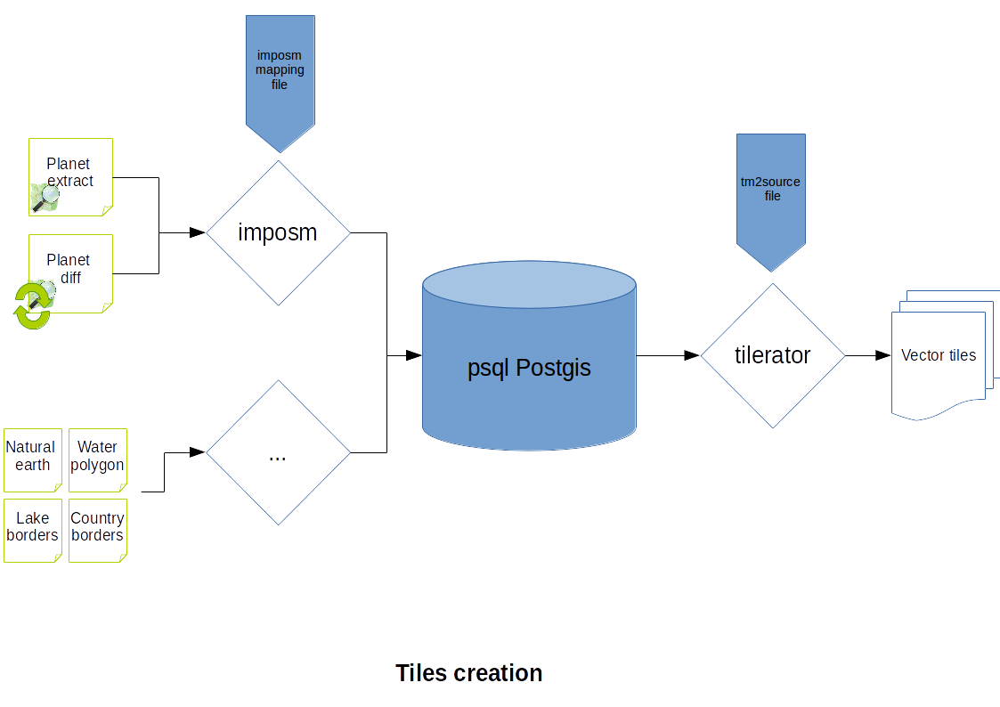
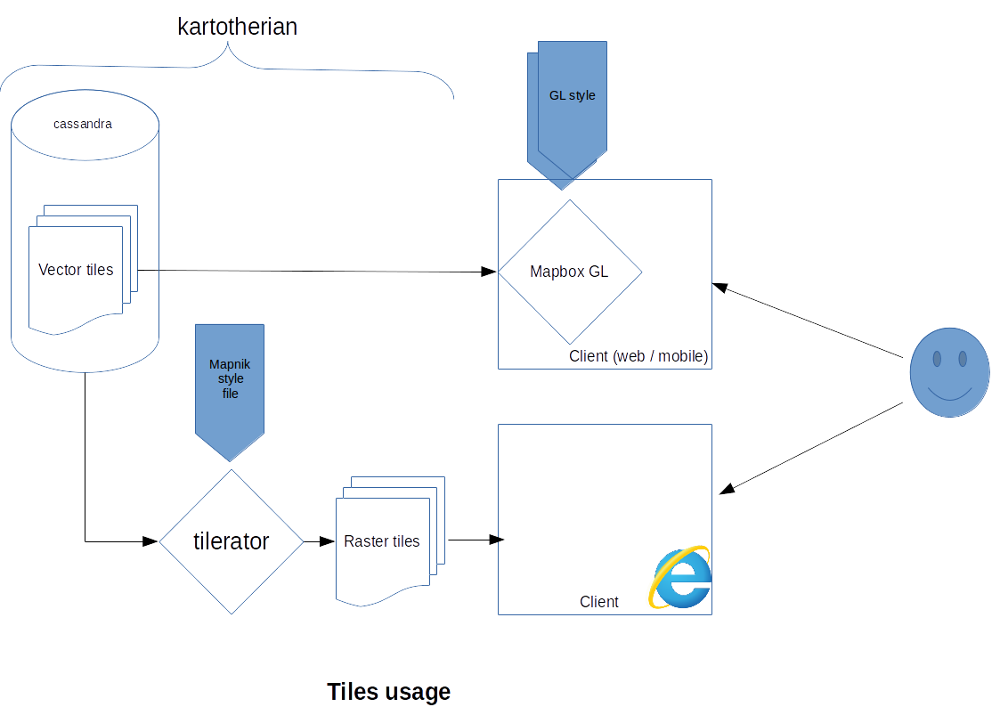

# kartotherian_docker
docker images for the [kartotherian project](https://github.com/kartotherian/kartotherian)

They use a mixed architecture of Kartotherian and [openmaptiles](https://github.com/openmaptiles/openmaptiles)


## "Quick" Start

Use these commmands to download, import data and create tiles jobs for Luxembourg:

(Optional) First, delete all related containers and volumes (from an older import):
```bash
docker-compose down -v
```
Download, import and start the tiles generation:
```bash
wget https://download.geofabrik.de/europe/luxembourg-latest.osm.pbf -P data/
docker-compose up --build -d
docker-compose exec load_db /srv/import_data/import_data.sh
curl -XPOST "http://localhost:16534/add?generatorId=substbasemap&storageId=basemap&zoom=7&x=66&y=43&fromZoom=0&beforeZoom=15&keepJob=true&parts=8&deleteEmpty=true"
curl -XPOST "http://localhost:16534/add?generatorId=gen_poi&storageId=poi&zoom=7&x=66&y=43&fromZoom=14&beforeZoom=15&keepJob=true&parts=8&deleteEmpty=true"
```

Once all tiles are generated, the map is visible on http://localhost:8585 !


## running

To launch kartotherian just do:

`docker-compose up`

(you might need `sudo` permissions depending on your setup)

to load data in postgres you need:

`docker exec -it kartotheriandocker_load_db_1 /srv/import_data/import_data.sh`

Note: the first import might be quite long are some additional data will be downloaded (cf [load_db](https://github.com/QwantResearch/kartotherian_docker/blob/master/load_db/readme.md))

After this you need to generate the tiles. You can do it either by generating all the tiles with:
`docker exec -it kartotheriandocker_tilerator_1 /gen_tiles.sh`

or only a subset using the api. `x` & `y` are based on the [Slippy Map Tile name](https://wiki.openstreetmap.org/wiki/Slippy_map_tilenames) system and you can use [Geofabrik's tool](http://download.geofabrik.de/europe/luxembourg.html) to generate these for a specific location.
For example to generate the tiles from 7 to 16 zoom level only for Luxembourg:

`curl -XPOST "http://localhost:16534/add?generatorId=substbasemap&storageId=basemap&zoom=7&x=66&y=43&fromZoom=7&beforeZoom=15&keepJob=true&parts=8&deleteEmpty=true"
`
`curl -XPOST "http://localhost:16534/add?generatorId=gen_poi&storageId=poi&zoom=7&x=66&y=43&fromZoom=7&beforeZoom=15&keepJob=true&parts=8&deleteEmpty=true"`

You can check the tile generation at `http://localhost:16534/jobs` and check a vector tile based map on `http://localhost:8585`


## archi




## configuration files

The `load_db/generated_sql.sql` and `load_db/imposm3_mapping.yml` and `tilerator/data_tm2source.xml` files have been generated using [openmaptiles-tools](https://github.com/openmaptiles/openmaptiles-tools).

The SQL and imposm mapping generation is quite straigthforward (cf. `generate-sql` and `generate-imposm3` in the [documentation](https://github.com/openmaptiles/openmaptiles-tools/blob/master/README.md)).

The `data_tm2source.xml` generation is a bit more complex.

we use `generate-tm2source` to generate a `Carto` project `.yml` file.
This file is transformed manually to a Mapnik `.xml` project using [kosmtik](https://github.com/kosmtik/kosmtik).

